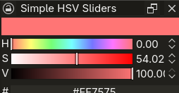

# Simple HSV Sliders

A simple HSV sliders color selection plugin for Krita, adapted for PyQt5 / PyQt6 dual compatibility.

## 兼容性说明

本插件兼容 **Krita 5.0 及以上版本**（支持 PyQt5 与 PyQt6 双引擎环境）。

## 鸣谢与版权声明 (Credits & Copyright)

This plugin is a modified version based on the original **HCL Sliders** plugin. All original design and logic credits belong to their respective authors:

*   **Original Author:** Lucifer (krita-artists.org/u/Lucifer)
*   **Incorporated Work:** Pigment.O Color Picker and Color Mixer by Ricardo Jeremias (Copyright © 2020)

This program is free software under the GNU General Public License version 3.
